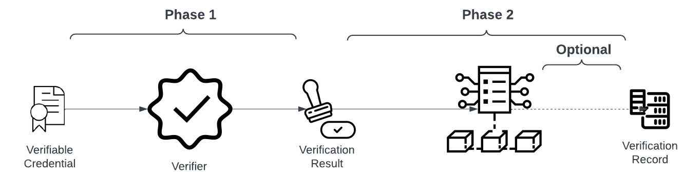
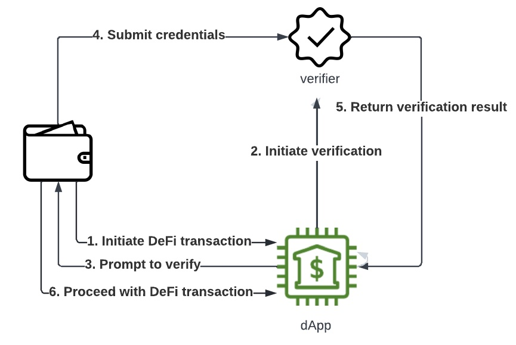
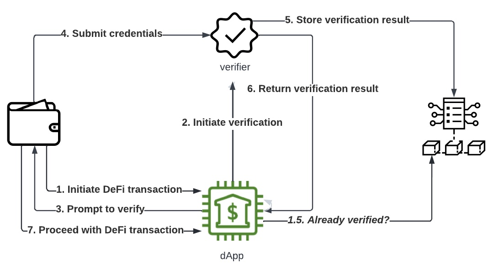
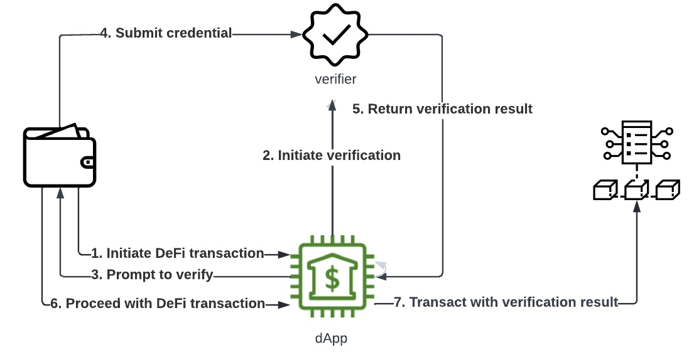
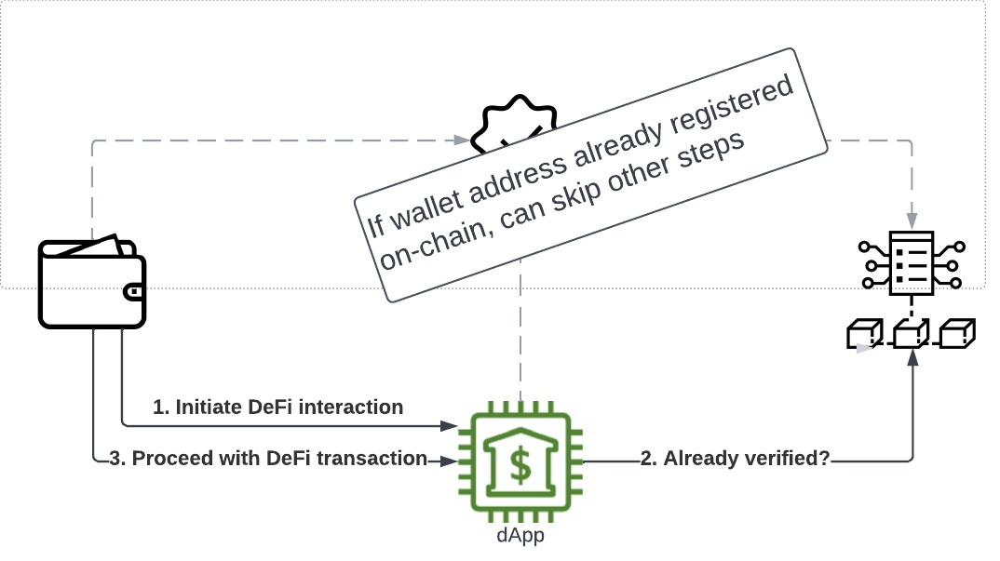

Since Verite’s original release, we’ve gotten feedback from development partners and the broader community about which patterns are useful and where guidance could be improved. Some themes include:

- Persistence of verification results to on-chain registries is over-emphasized.
- Verite’s current [verification flow documentation](https://verite.id/verite/patterns/verification-flow) assumes that Verifiable Credentials (VCs) are stored in wallets that support decentralized identity protocols, which are currently somewhat scarce in the market.

Upcoming Verite releases (including code and documentation) will address these concerns as follows:

1. A forthcoming editorial revision of Verite documentation will explicitly describe a variant of the subject-submission patterns without any on-chain persistence.
2. A coming release will include code and documentation demonstrating how more of today’s wallets can participate in VC flows in a standardized way, until DIDs become more common.

In this two-part blog series, we’ll preview these updates. This post (Part 1) includes an overview of options for the use of off-chain VCs to support on-chain decision-making, including subject-submission without on-chain persistence. This begins with a summary of core concepts and principles of Verite. Readers already familiar can skip ahead to the "Two Phases of Verification" section for an overview of the new flow being added to the Verite docs and pioneered by Circle’s implementation. After this new end-to-end pattern for Verite is outlined, a more analytical "Discussion" section follows.

The second post in the series will zoom in on how wallets that do not currently support sufficient functionality for emerging decentralized identity patterns can be "retrofitted” and supplemented to support Verite’s off-chain verifications like those described in this post.

# Verification Concepts

If you’re new to Verite, or want a reminder, this section describes how Verite credential verification works off-chain to support smart contracts with maximum privacy around sensitive identifying information.

## Roles

The following entities are involved in the Verite credential verification process:

- _Crypto wallet_: aka "payment wallet”, controls a blockchain address; may be browser or mobile, hosted or self-hosted.
- _Credential wallet_: aka "identity wallet”, stores and shares VCs, controls a "DID” (meta-wallet identifier). Some or all of these functional roles may be subsumed into a crypto wallet or a trusted dapp, or this entity may be completely distinct software, depending on flow and trust model.
- _Verifier_: aka the "verifier service” or "verifier endpoint” that consumes a privacy-preserving, off-chain token (a verifiable credential) on behalf of a dApp. It can be operated by the dApp or a trusted partner but in either case it needs to be previously known to and trusted by the dApp at a static address.
- _dApp_: decides which verifiers to trust; the dApp frontend is responsible for triggering the verification process; the dApp backend is responsible for on-chain validation
- _On-chain verification registry_ (optional): depending on the implementation choices, dApps may rely on on-chain storage of verification results. This may be part of the dApp or a separate registry accessible by other parties. For simplicity, we’ll assume the former case in this blog.

## Verification Result

A Verification Result enables a "verified” crypto wallet – that is, a wallet whose controller has proven possession of a valid VC that has passed a dApp-trusted-verifier’s verification process – to interact on-chain.

You can think of a Verification Result as the result of slicing and dicing a VC, potentially obfuscated, with an attached proof from the Verifier. The Verification Result structure in Verite’s reference implementation includes the following fields, returned along with the Verifier’s cryptographic signature:

- _subject_: identifies the wallet address
- _schema_: indicates the kind of credential (flexible according to the implementation)
- _expiration_: a number that is less than or equal to the expiration value in the VC.

The Verification Result may be extended to include additional fields, which could be carried over identically or fuzzed/obfuscated in some way (which is especially relevant if using on-chain storage).

```
export type VerificationResult = {
  schema: string
  subject: string  // address
  expiration: number
}
```

## Verifier vs Subject Submission

Verite’s implementation demonstrates two possible methods of submitting Verification Results to smart contracts; or in other words:

- Verifier-submitted: the verifier submits the Verification Result and signature directly to the smart contract immediately after verification.
- Subject-submitted: the verifier returns the Verification Result and signature to the subject (or an entity or code acting on the subject’s behalf) who then submits the signed Verification Result to the smart contract.

# Verification Principles

While verifications can be carried out using a variety of methods, all are expected conform to the following principles:

1. **Trusted issuer principle**: the credential was issued by one of a list of trusted issuers.
2. **Credential ownership principle**: The crypto wallet that owns (i.e. can prove themselves to be the subject of) the credential is the one making the DeFi transaction request, regardless of whether the credential itself is held and presented by a separate piece of hardware (i.e. whether the credential wallet and the crypto wallet are distinct)
3. **Trusted verifier principle**: The verifier that provides verification is on the allowlist of verifiers already trusted by the dApp.

The fact that all Verified Credentials are signed by their self-identifying issuers makes the first criteria simple: issuers’ public keys can be obtained from the identifiers listed in a registry of trusted issuers, and their signatures can be checked against them at verification time. In this way, the _verifier_ **enforces **the trusted issuer principle.

DApps, in turn, **uphold **the trusted verifier principle, deciding which verifiers they trust to verify VCs – including standard VCs checks (non-revocation, tamper-free) and any other fitness-for-purpose checks (such as subsetting valid Verite credentials according to additional constraints on issuers or [KYC processes](https://verite.id/blog/crossfunctionationality)).

Enforcement of the credential ownership principle will vary depending on how the crypto wallet relates to the credential wallet. In this post, we’ll describe how this works with a distinct decentralized identity wallet controlled by the same actor as a crypto wallet; in the next, we’ll describe how crypto-wallets-only actors may be accommodated.

# Two Phases of Verification

Verite’s [Smart Contract Patterns](https://verite.id/verite/patterns/smart-contract-verite) documentation describes the two-phase process of how smart contracts can require successful verification of VCs. To summarize:

- Phase 1: "Off-chain” verification by a verifier, based on traditional web or API stacks, resulting in a lightweight "Verification Result” object.
- Phase 2: On-chain validation of the Verification Result, which is optionally persisted on-chain in private, obfuscated, or opaque form referred to as a "Verification Record”.



The two-phase process enables the use of VCs with chain-based applications for which verification operations are not technically possible and/or economically practical. More importantly, this reduces (by construction) the amount of potentially sensitive data sent on-chain. All examples that follow will refer to main-net Ethereum, but all these patterns should be replicable on all major chains, availing themselves of further privacy or obfuscation techniques where supported.

The subsequent sections discuss these phases and variations. This first post in the two-part series assumes a decentralized identity wallet, and the next will cover other options.

# Phase 1: Off-chain Verification

**_Assuming a Decentralized Identity+Crypto Wallet_**



1. The _wallet_ initiates a DeFi transaction with a _dApp_.
2. The _dApp_ (frontend) chooses a trusted _verifier_ to start the verification process.
3. The _verifier_ responds to the wallet, telling it how to start the process[^1] through the _dApp_.

4. The _wallet_ chooses one of the credentials stored locally and submits it to the _verifier_.
5. The _verifier_ confirmed the credential’s signature and the validity of its contents. The _dApp_ retrieves (via callback or polling) confirmation.
6. DApp unlocks the subsequent DeFi transaction flow.

## Ownership verification

In step 4, when the wallet submits the credential, the wallet wraps the VC with a Verifiable Presentation (VP) and signs it. When the verifier receives the credential, it uses the Decentralized Identifier (DID) – for example, `did:key:<public_key>`[^2] – listed as `holder` in the VP to verify the JWT’s signature (made from the corresponding private key). It also compares this DID in the VP with the DID listed as `credentialSubject.id` in the VC, i.e. the public key that the credential was issued against. Those two checks guarantee the wallet, submitting the credentials, was the same wallet that the issuer intended, and thus rightly owns it.

# Phase 2: Validation and use in smart contracts

The second phase of verification covers how a Verification Result gets used as a prerequisite to on-chain interaction.

## Validating a Verification Result

Along with a verification result, a smart contract will receive a signature on the result, allowing them to confirm that the result was provided by an authorized party, as described [here](https://verite.id/verite/patterns/smart-contract-verite#verification-results).

## On-chain storage of Verification Results (or not)

We’ll look at 3 cases below. With the verifier-submitted pattern, the verifier always stores the Verification Result on-chain. With subject-submission, the Verification Result may or may not be stored on-chain, depending on the implementation.

### Case 1: Verifier-submitted verification result, stored on-chain

With the verifier-submitted approach, the verifier stores the Verification Result on-chain after verification.

_We’ll cover step 1.5 later; this is relevant for subsequent interactions with a dApp when on-chain storage is used._



### Case 2: Subject-submitted verification result, stored on-chain

The subject-submitted approach also supports persistence, as determined by the implementor. Like the verifier-submitted case, in subsequent interactions, the dApp will be able to determine that the wallet is already registered.

_We’ll cover step 1.5 later; this is relevant for subsequent interactions with a dApp when on-chain storage is used._


### Case 3: Subject-submitted verification result, off-chain

If the Verification Result is not persisted on-chain, then every interaction of the wallet with the contract will be associated with a fresh, unique Verification Result.



# Subsequent interactions

Assuming the implementation is using on-chain storage, after the phases 1 & 2 (plus on-chain storage) are completed, then on subsequent interactions, a dApp could check the registry to confirm the wallet/address is already approved, avoiding the need to re-verify the VC. The dApp backend (or registry, if separate) can simply check that `msg.sender` is in the set of registered addresses.



Without on-chain storage, in general the VC would be re-verified[^3] each time (as shown in the diagram in Case 3), and the verification result submitted along with the transaction. Since verification is off-chain (and generally fast/inexpensive, depending on the provider), and since this avoids on-chain storage of potentially correlatable data, this is often the preferred solution.

# Discussion

## On-chain Storage Considerations

The on-chain storage patterns have implications that require careful consideration:

1. On-chain persistence of any potentially identifiable (or re-identifiable) data should be avoided. If on-chain persistence is used, it is up to the design of a particular implementation to manage that smart contract’s access rights and obfuscation mechanisms to minimize privacy risks.
2. The verifier-submitted pattern, in its current form, assumes the verifier’s willingness to pay transaction fees (e.g. "gas fees”, in EVM systems).
3. The verifier-submitted pattern includes an obligation that the verifier update the on-chain state corresponding to revoked credentials.
4. In general, this may not be the most cost-effective option.

There are optimizations – in the Verite open source, the Verification Registry may be used among multiple contracts, and [proposed improvements enable further reuse through proxies](https://mirror.xyz/0xFd283fBb301f332A94969f629E1832824DEA3684/IFYyHg6OUQVj4QurIOOpVvHHBWaC1cJzdI6B4OU15WM). These are all possible for implementations; Verite’s open source repositories are intended as example implementations, and not as normative guidance.

However, we think it’s important to draw attention to off-chain options, as it has a profile of privacy characteristics we find favorable in many use-cases. This is one of the reasons we’re increasingly demonstrating this option, as seen in the [off-chain NFT allowlist](https://verite.id/blog/NFT-allowlists-with-verifiable-credentials-and-verite).

## Circle’s Implementation Choices

It was not necessary to write the verification results to on-chain storage in Circle’s implementation. The advantages of flushing to chains include the avoidance of repeated verification for the same wallets. However, the advantages do not always outweigh the drawbacks:

1. Short TTL is required for verification because a user's KYC status could change.
2. Chain writers must pay a gas fee.

As a result, Circle chose and suggests other implementers also choose this approach: do not write verification results into chains unless there is a substantial efficiency gain, i.e., if many transactions will be authorized by the average on-chain write operations.

Since Circle’s architecture is optimized for delivering verification reliably and simply to dApps, we choose to explain the design choices we’ve made from the perspective of the verification process, where valid Verifiable Credentials get communicated to smart-contracts powering dApps.

## Up Next

In the following post, we’ll describe options for wallets that don’t understand Decentralized Identity protocols to participate in VC exchanges, while conforming to the verification principles above.

The Verite core team is grateful to Circle’s Verite engineers Tao Tao, Daniel Lim, and Fei Niu for taking the lead on this exciting work!

[^1]: Crucially, this includes not just the usual redirections and tokens but also an artifact called a "Presentation Submission" object which describes the credentials that a given verifier will accept. This enables wallets to “pre-select” appropriate credentials to the end-user, in the case of a full wallet.
[^2]: An "onchain DID" (decentralized identifier) scheme such as did:ion can be used here if the wallet controls such an identifier– this is basically a user-controlled indirection, which allows user-initiated rotations and even migration to a new wallet. In an end-to-end system, however, this indirection is optional, because the verifier has access to the issuance records, and can simply use a public key in both places since they are opaque to any other audience.
[^3]: The verite reference implementation avoids resubmission of the same verification results / signature to avoid replays
