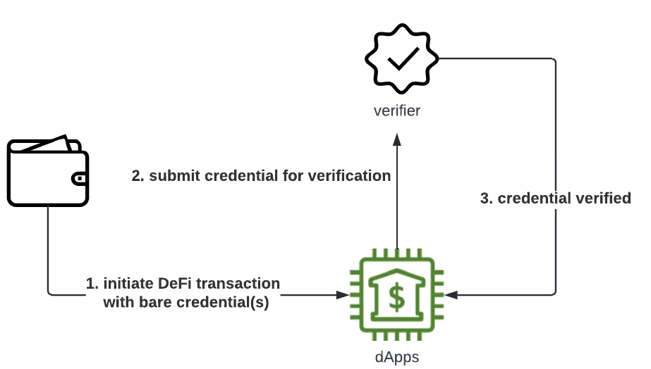
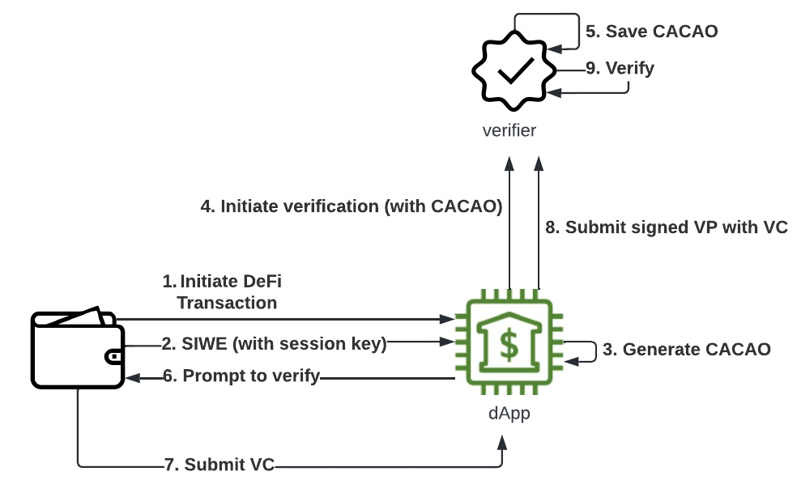

Part 2 of this 2-part series explains the [did:pkh](https://github.com/w3c-ccg/did-pkh/blob/main/did-pkh-method-draft.md)/[CACAO](https://github.com/ChainAgnostic/CAIPs/blob/master/CAIPs/caip-74.md#simple-summary) variation for Verite data models and flows, which provides an entry path for wallets that may not support sufficient functionality for emerging decentralized identity patterns

Since some wallets may not themselves be willing to embed protocol-specific logic (interaction with verifiers) or more general verifiable-credential logic, we have to find a kind of "**minimum viable**" level of support for today’s non-DID-enabled crypto wallets. While handling DIDs and signing Verifiable Presentations brings a kind of secure indirection that enables portability and multi-chain wallets, these properties are not strictly essential to the core functionality of Verite. For this reason, we define a crypto wallet that can receive and pass to dApps a Verifiable Credential issued against its blockchain address adequate, with a few adjustments and supplements.

## Phase 0: Issuance Directly to Crypto Wallet

In a crypto-wallet centric end-to-end flow, the trust model is different and the interplay between credential wallet and crypto wallet can be greatly simplified. The credentials themselves must also be slightly different– instead of obtaining the credential subject DID directly from the wallet to which they are being issued, the issuer will use a credential subject identifier based on a specific blockchain address controlled by that wallet. Using DID terminology, rather than attest to the controller of a wallet, it attests only to a specific address controlled by that wallet.

This greatly simplifies the ownership question, by relying on native mechanisms for proving ownership of the address– at the time of issuance, as well as at time of verification of the credentials.

### Two Options of Expressing a Blockchain address as a DID (and as a VC subject)

Instead of defining the subject of the VC as a chain-agnostic DID provided by the wallet, the issuer will deterministically generate a DID from the blockchain address controlled by the connected wallet. Multiple DID methods allow this possibility; we’ll describe two of them, assuming a wallet with an Ethereum address (referred to as `ETH_ADDRESS`).

- **did:key method - issue against a crypto wallet’s public key**: If the issuer has the wallet address `ETH_ADDRESS` and any signature over a known message, the corresponding public key can be recovered using the `ecrecover` mechanism ported over from Bitcoin in the early days of Ethereum. In this way. the issuer can deterministically obtain a[ did:key](https://w3c-ccg.github.io/did-method-key/) DID that will be used as the value of `credentialSubject.id`. This is the method Circle will begin with, for ease of implementation by participants.
  - In this case, the mapping is:` did:key:<ecrecover(ETH_ADDRESS, signature)>`
  - For blockchains that do not use a Bitcoin-style pay2hash address system, like Solana and Polkadot, no recovery from a signature is necessary because the base form of the address is already a public key supported by <code>[multibase](https://datatracker.ietf.org/doc/html/draft-multiformats-multibase) </code>and thus by <code>[did:key](https://w3c-ccg.github.io/did-method-key/#introduction)</code>.
- <strong>did:pkh method - issue against a crypto wallet’s public address</strong>: Other DID methods, like [did:pkh](https://github.com/w3c-ccg/did-pkh/blob/main/did-pkh-method-draft.md), allow DIDs to be defined directly based on blockchain addresses in their commonly-used, public-facing forms. Long term, this is the preferred method. Among other advantages, the implementation across chains is more apparent.
  - In this case, the mapping is: <code>did:pkh:eip155:1:&lt;ETH_ADDRESS&gt;</code>. eip155 here refers to the EVM namespace (defined in EIP155), while 1 refers to the ethereum mainnet according to EIP155.
  - Just as the did:key URI scheme relies on the <code>[multibase](https://datatracker.ietf.org/doc/html/draft-multiformats-multibase)</code> registry, so does the did:pkh URI scheme rely on the ChainAgnostic Standards Alliance’s [namespace registry](https://github.com/ChainAgnostic/namespaces) to add non-EVM namespaces.
  - In cases where human-readability is important, end-users can introspect the VC and see their familiar address, as opposed to a public key that in pay2hash systems like BTC or ETH, they might never have seen or know they control

### Sign-In With Ethereum and dApp-native Identity

Wallets that have not incorporated decentralized identity capabilities rarely support JWT \_signing \_features, or other token mechanics that are common to the traditional web2 identity world. For this reason, many web3 sites and dApps have started using the wallet connection pattern to create a more feature-rich and auditable session mechanism via offchain message signing (i.e. `personal_sign` on EVM systems). Equivalents for other blockchain ecosystems, such as Solana, are forthcoming.

In the case of issuance, this signature is enough to extract the crypto wallet’s public key, as mentioned above. Importantly, though, it also enables delegated keys to sign offchain events without another onerous or fraught wallet-interaction, as we will see below.

## Phase 1: Off-chain Verification

### Variant: Crypto-Wallet only with only VC storage capabilities

At verification time, when a wallet "connects” to a dApp by providing an off-chain signature over a structured [authentication message](https://github.com/ethereum/EIPs/blob/5e9b0fe0728e160f56dd1e4cbf7dc0a0b1772f82/EIPS/eip-4361.md#informal-message-template), the dApp will have the wallet’s address (and live proof-of-control, if the authentication message included a secure nonce) so it can simply compare this address with the corresponding DID:PKH `credentialSubject.id` of the VC. This way, the verifier will not need to do an ownership check on the VC, and the dApp can trust the verifier to have received credentials from the right wallet because it, too, will require a wallet connection and prove ownership of the same wallet.

Without necessarily even having to parse, validity-check, or introspect the verifiable credentials, any wallet that can store them (whether as JWTs or even as raw text files) can submit them directly to verifiers, as shown below.

_Note: while it is recommended that crypto wallets parse verifiable credentials and check their validity or safety, crypto wallets could in theory allow blind passthrough if the user can assume the responsibility for their contents. In the Verite case, there are little security concerns or abuses possible._

By itself, however, this bare VC is inferior to a VP from a full-featured decentralized-identity wallet, since it does not contain a non-repudiable off-chain wallet signature for auditing purposes. Or, to put it another way, it is only as trustworthy as the authentication of the wallet that sent it to you, and there is little standardization of the receipts you keep of crypto-wallet authentication to replay it for a future auditor or security review.

While the corner cases of impersonation or exfiltrated VCs might be vanishingly rare, the "audit trail” of a bare VC is weaker than a VC wrapped in a timestamped signature. For this reason, we encourage Verite dApps to create a functional equivalent to a verifiable presentation in the form of a signed presentation receipt (signed with a session-specific ephemeral key) for logging purposes. To accomplish this, we return to the Sign-In With Ethereum pattern to elaborate on its key delegation feature.

#### Sign-In With Ethereum Flow

As mentioned above, we support the emerging standard approach of the "Sign-In With Ethereum” mechanism which defines a sign-in message that includes a domain-binding anchor, an ephemeral session key, and other caveats. While the ephemeral session key property was not essential to the issuance wallet connection, it can be useful in the verification situation for more trustless (and auditable) logging.

By generating an ephemeral key and including it in the initial wallet-connection message for the crypto wallet to sign over upon authenticating itself to the dApp, the wallet effectively "delegates” that ephemeral key for the duration of the session. In UX terms, this saves the user from a distinct off-chain wallet signature at each confirmation or consent event. Carefully defining the [other properties](https://eips.ethereum.org/EIPS/eip-4361#message-field-descriptions) of the SIWE message, dApps can secure and constrain that delegation, link to an applicable terms-of-service agreement, enable DNS-based domain-checks analogous to the "lock symbol” in modern browsers, etc.

Once the user has "connected” their wallet by signing this SIWE message, a CACAO is generated as a receipt of that session (and of the delegation of signing rights to the key). This allows the dApp to use smoother UX than requiring a full off-chain wallet signature to confirm each consent event or internal transaction (such as the presentation of VCs in a signed VP). But it also provides a compact and tamperproof way of encapsulating each event or internal transaction as a time-stamped and signed object for logging purposes– this makes each event as verifiable as an off-chain (or on-chain) signature, via the indirection of the delegated key.

#### Ownership Verification

You could say that the crypto wallet delegates the encapsulation and signature of a VP to the dApp, which creates a short-lived key with which to sign the VP, which is a kind of standardized logging object for a presentation event. This allows the verifier to **confirm** that the dApp is interacting on behalf of the wallet. Since the Verifier has confirmed control of the wallet address with a SIWE message, and the VC is issued to the address directly, there is no ownership verification needed as with a decentralized wallet; thanks to the CACAO, future auditors can replay these interactions and re-check signatures and tamper-proof objects to confirm all of these transactions trustlessly.

#### Detailed Flow

1. Wallet initiates DeFi transaction with dApp.
2. dApp generates a session-specific ephemeral signing key and encoded it in the SIWE message for the wallet to sign. This generated session key will delegate the wallet for future signings, once after wallet vouches it (by signing the CACAO).
3. Once the wallet has signed it and returned it to the dApp, the signature and message are encoded into a compact [CACAO](https://github.com/ChainAgnostic/CAIPs/blob/master/CAIPs/caip-74.md) session receipt for logging and forensic purposes (if needed).
4. Next the dApp lets the verifier know about the session, by POSTing the receipt to an endpoint (eg. [signIn](https://github.com/centrehq/verite-minter-allowlist/blob/main/backend/src/index.js#L136)). The signed receipt also includes [caveats](https://github.com/ChainAgnostic/CAIPs/blob/master/CAIPs/caip-74.md#test-cases), a domain-binding, an expiration, and other constraints to secure the delegation and the transfer of the session parameters.
5. The verifier saves the CACAO. The verifier only uses this CACAO in the scope of this verification session (to prove the VP signed by the ephemeral key). Once the CACAO verification step is completed, the session object will be updated.
6. Instead of sending the wallet to verify directly with the verifier (as in the previous post), the wallet will submit the VC directly to the dapp (or an agent/service it trusts). The dApp presents the prompt to verify.
7. Wallet submits the bare VC.
8. Subsequent requests from the dApp will include a reference to the session which the verifier can use if they need to check signatures made by that key. The VC(s) submitted by the dApp in this case will not be signed in a VP with the wallet’s key; instead, it/they will be put into a VP and signed _by the dApp_ using the ephemeral key (the signing key mentioned in the first step above) delegated to it by the SIWE message. Introspection into the CACAO is required to extract the public key that signed the VP, as well as a signature from the wallet key over the public key.
9. When all the information is submitted to the verifier, the verifier needs to examine the ownership of the credential:
   1. Extract the public key of the session signing key from the resources section of the CACAO
   2. Use the public key of the session signing key to validate the VP’s signature. This is to ensure that the dApp properly (which held the key and got user consent to delegate signing rights to it) signed the VP and that it has not been tampered with in transport.
   3. Compare `iss` in CACAO with the wallet’s DID in VC (in this case a did:pkh representing the wallet address as a long URI). They should match, if the dApp’s SIWE message. conforms to the SIWE specification. This is to check the wallet which vouched the session key is the subject (and holder) of the VC, which is also connected to the dApp with a signature over a nonce, included in the CACAO to keep future auditors from having to trust the verifier.

## Conclusion:

Circle’s implementation of the Verite protocol allows us to serve our customers and the dApps they interact with equally, putting the rigor of our KYC processes at the service of a process that is auditable and verifiable end-to-end without duplicating KYC process or PII from those processes across the chain of asset custody. We are proud to be driving the Verite process, and welcome more implementations, whether end-to-end issuer+verifier solutions like ours or more focused implementations that bring more wallets and more users into the ecosystem.

As the Circle team updates its documentation and sample implementation to reflect the new patterns and flows, we will continue to work with them to share the insights we are gaining from our exploratory work with dApps and clients.
